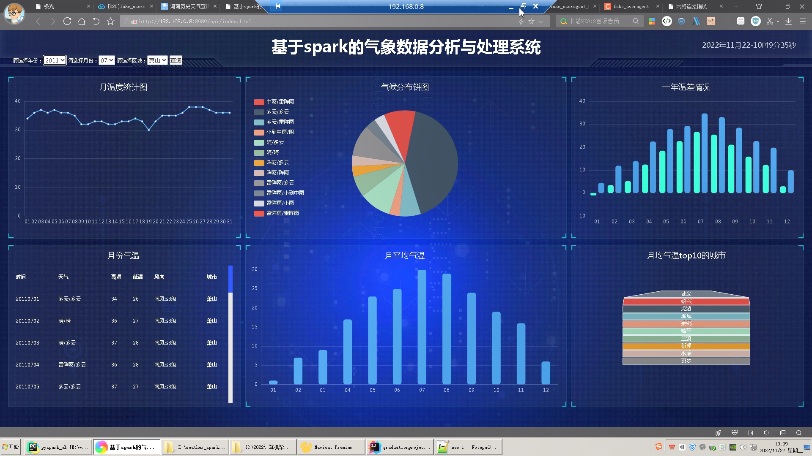
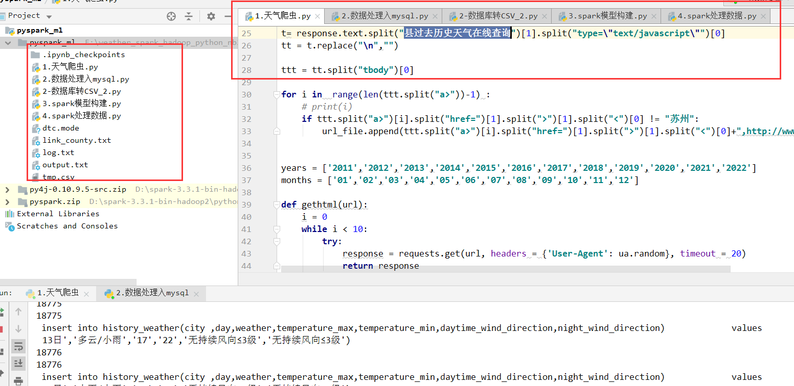
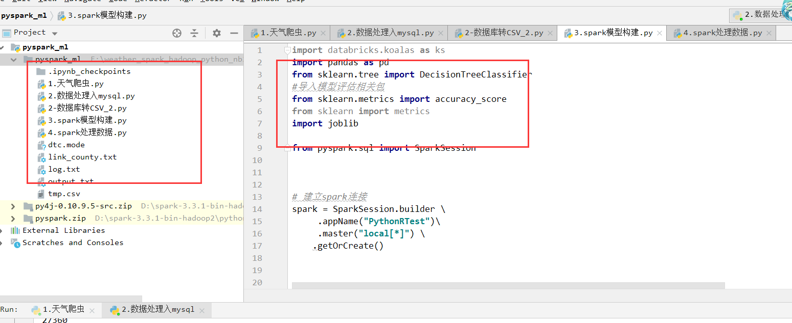
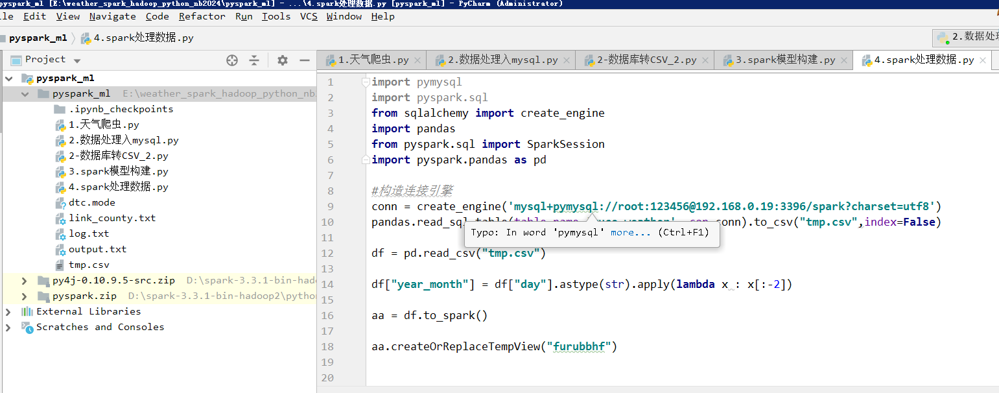
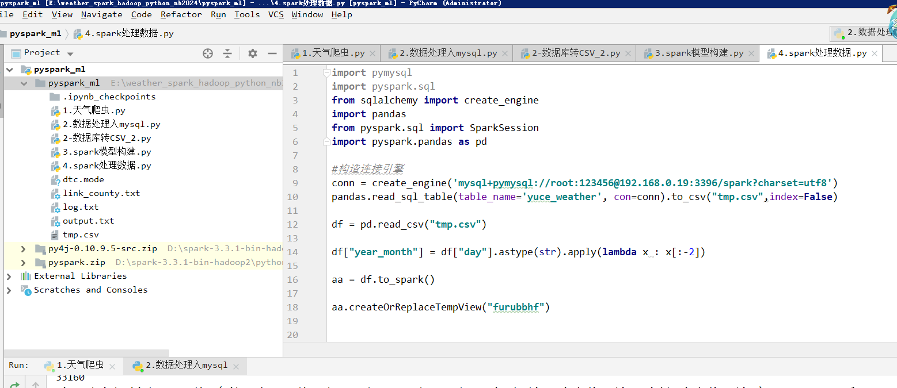
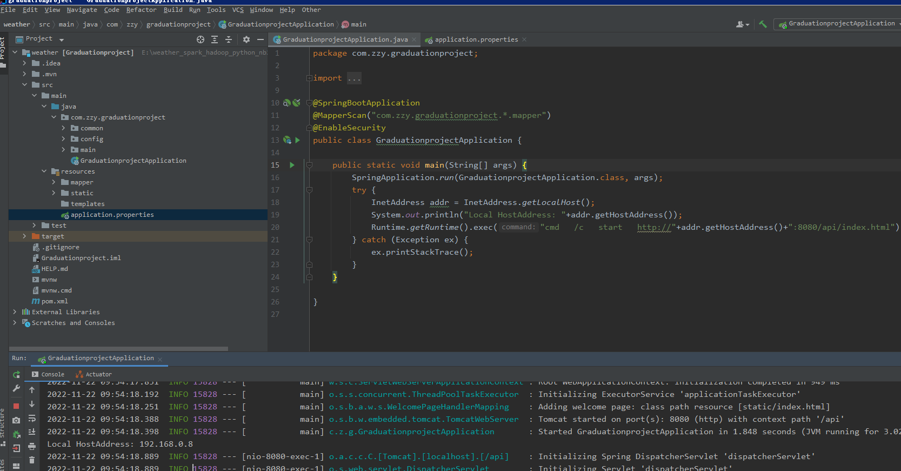

# 计算机毕业设计吊炸天遥遥领先hadoop+spark天气预测系统 天气可视化 深度学习 天气大数据 大数据毕业设计 大数据毕设

## 要求
### 源码有偿一套(论文 PPT 源码+sql脚本+虚拟机)
### 
### 加好友前帮忙start一下，并备注github有偿获取源码
### 我的QQ号是2877135669 

### 或者 微信 bysj2023nb

### 加qq好友说明（被部分  网友整得心力交瘁）：
    1.加好友务必按照格式备注git虚拟机电影推荐
    2.避免浪费各自的时间

## 开发技术

python爬虫、spark、hadoop、sklearn、深度学习模型、echarts、springboot

## 补充说明
适合大数据毕业设计、数据分析、爬虫类计算机毕业设计

# 运行截图

# 演示视频

https://www.bilibili.com/video/BV1VP411u7FK/?spm_id_from=333.999.0.0